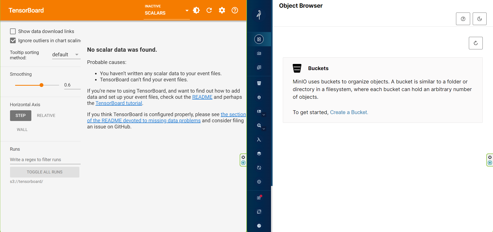
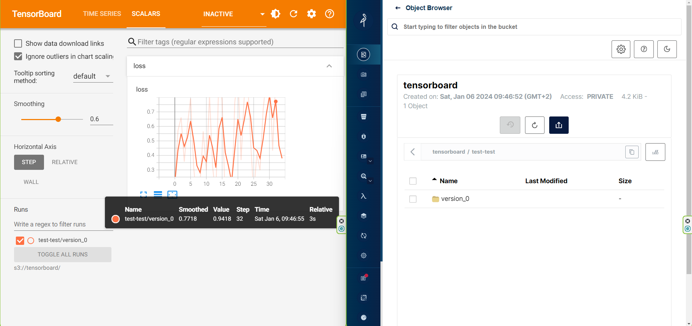
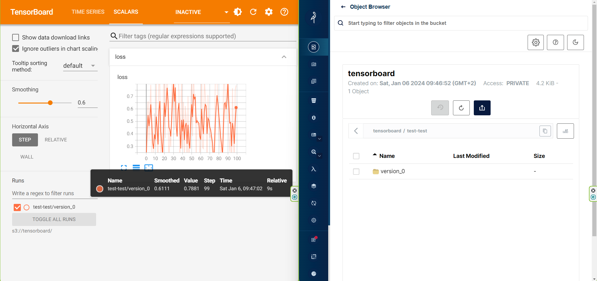
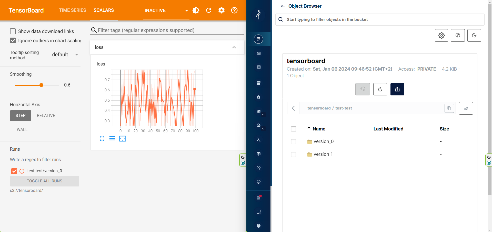
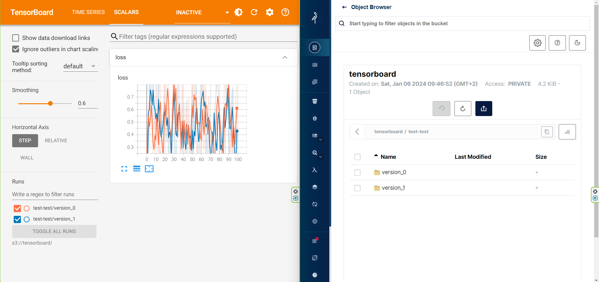
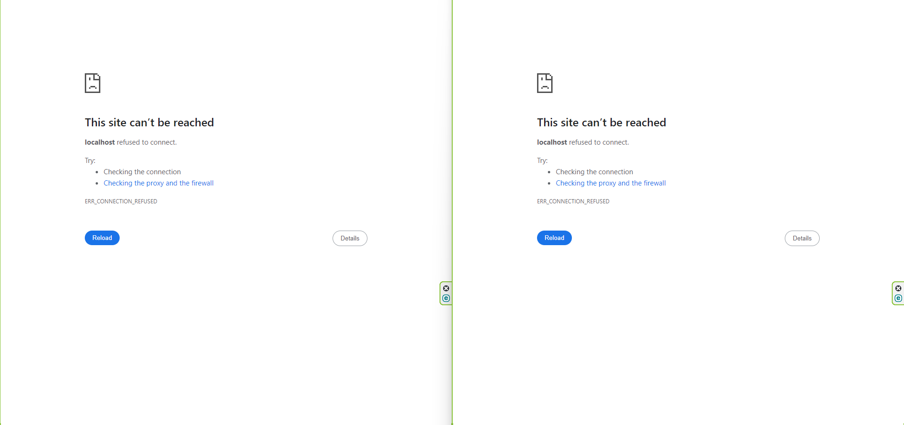

# Reproduce my error
requirements:
1. `docker`
2. online access

steps:
1. run `setup.sh`, this will start the minio & tensorboard servers
2. run `step-1.sh` and follow its instructions, it writes a single experiment to minio
3. run `step-2.sh` and follow its instructions, it restarts minio & tensorboard
4. run `step-3.sh` and follow its instructions, it writes a second experiment to minio
5. run `step-3.sh` and follow its instructions, it restarts minio & tensorboard again
6. run `teardown.sh`, this will remove the created bucket and stop minio & tensorboard

side-effects:
1. `mc`, the minio client, is installed.
2. the `quay.io/minio/minio:latest` docker image is downloaded
3. the `python:3.10.13` docker image is downloaded and the local image `s3-tensorboard` is built from it

screenshots:
1. after setup:   
2. after step-1:   
3. after step-2:   
4. after step-3:   
5. after step-4:   
6. after teardown:   
